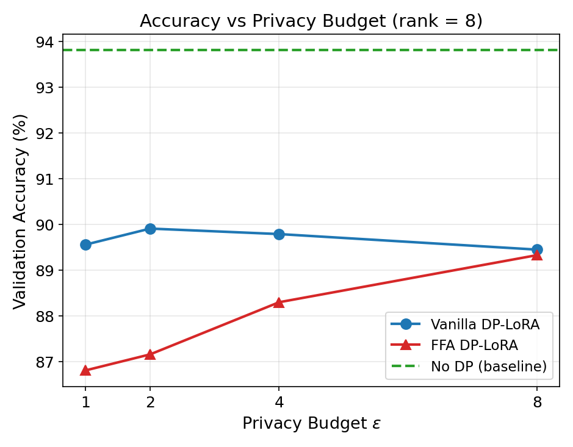
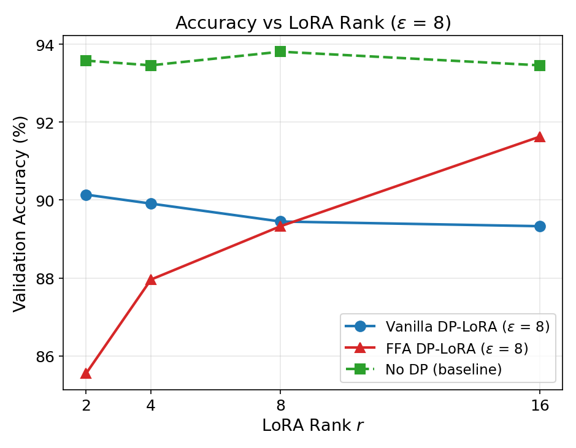
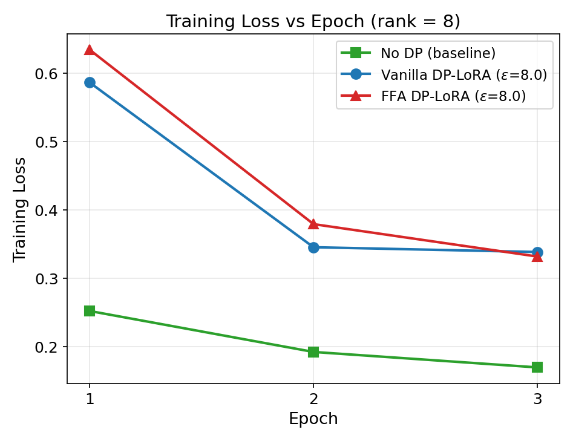
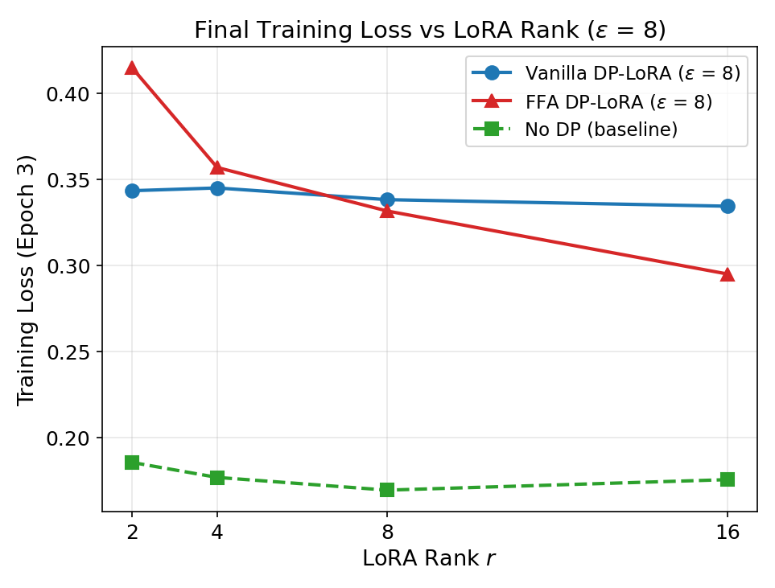

# dp-lora

**Differentially private LoRA fine-tuning for HuggingFace Transformers.**

A drop-in Python library that adds formal differential privacy guarantees to [LoRA](https://arxiv.org/abs/2106.09685) (Low-Rank Adaptation) fine-tuning. Built on top of HuggingFace [PEFT](https://github.com/huggingface/peft) and [Transformers](https://github.com/huggingface/transformers), with privacy accounting via Google's [dp-accounting](https://github.com/google/differential-privacy/tree/main/python/dp_accounting) library.

```bash
pip install dp-lora
```

## Why DP-LoRA?

Fine-tuning large language models on sensitive data (medical records, financial data, private communications) risks memorizing and leaking individual training examples. Differential privacy (DP) provides a mathematical guarantee that no single training example significantly influences the model's outputs.

**The problem with DP + full fine-tuning:** DP-SGD adds Gaussian noise to gradients, and the noise magnitude scales with `sqrt(d)` where `d` is the number of trainable parameters. For a 125M-parameter model, this noise is devastating.

**LoRA solves this.** By reducing trainable parameters from millions to thousands (via low-rank decomposition), LoRA dramatically improves the signal-to-noise ratio under DP. A rank-8 LoRA adapter on RoBERTa-base trains only 887K parameters (0.71%) — enabling meaningful learning even under strict privacy budgets.

## Background: How LoRA Works

LoRA ([Hu et al., 2022](https://arxiv.org/abs/2106.09685)) freezes the pre-trained weights `W_0` and injects trainable low-rank matrices:

```
W = W_0 + BA
```

where `B` is `d x r`, `A` is `r x k`, and `r << min(d, k)`. Only `A` and `B` are trained. The forward pass becomes:

```
h = W_0 * x + (alpha / r) * B * A * x
```

Key properties:

- **10,000x fewer trainable parameters** than full fine-tuning
- **Zero inference latency** — merge `BA` into `W_0` at deployment
- **Matches or exceeds** full fine-tuning performance (93.8% vs 94.0% on SST-2)

## Supported DP Methods

### Vanilla DP-LoRA

Standard DP-SGD applied to both `A` and `B` matrices. Each training step:

1. Compute per-sample gradients for all LoRA parameters
2. Clip each sample's gradient to norm `C`
3. Sum clipped gradients and add calibrated Gaussian noise `N(0, sigma^2 * C^2)`
4. Update parameters with the noised gradient

The privacy guarantee follows from the post-processing theorem — any optimizer (Adam, SGD, AdamW) applied to the noised gradients preserves the same (epsilon, delta)-DP bound.

### FFA DP-LoRA (Freeze-A)

Based on [Sun et al., 2024](https://arxiv.org/abs/2403.12313). Freezes the `A` matrix after random Gaussian initialization and trains only `B`. This:

- **Halves trainable parameters** — fewer noise dimensions, better SNR
- **Eliminates quadratic noise amplification** in federated settings (the cross-term `noise_B * noise_A` vanishes when A is frozen)
- **Scales strongly with rank** — higher rank gives more expressive capacity through the frozen random projection

### Ghost Clipping

Memory-efficient mode that computes per-sample gradient **norms** without materializing the full `[batch, out, in]` gradient tensors. Uses a Cauchy-Schwarz upper bound for sequence inputs, which is safe for DP (over-clipping never hurts privacy). Enabled via `ghost_clipping=True`.

### Virtual Batching

Simulates large logical batch sizes (e.g., 256) using small physical micro-batches (e.g., 32) via gradient accumulation with proper DP semantics. Larger batches improve DP utility because noise is amortized over more samples per step.

## Quick Start

### Using the Privacy Engine (recommended)

```python
import torch
from transformers import AutoModelForSequenceClassification
from peft import LoraConfig, get_peft_model
from dp_lora import DPLoRAEngine

# 1. Create model with LoRA
base_model = AutoModelForSequenceClassification.from_pretrained("roberta-base", num_labels=2)
model = get_peft_model(base_model, LoraConfig(r=8, target_modules=["query", "value"]))

# 2. Set up optimizer and dataloader (standard PyTorch)
optimizer = torch.optim.AdamW(model.parameters(), lr=5e-4)
train_loader = ...  # your DataLoader

# 3. Make it private
engine = DPLoRAEngine()
model, dp_optimizer, dp_loader = engine.make_private_with_epsilon(
    model=model,
    optimizer=optimizer,
    data_loader=train_loader,
    target_epsilon=8.0,        # privacy budget
    target_delta=1e-5,         # privacy parameter
    epochs=3,
    max_grad_norm=1.0,         # per-sample gradient clipping
    method="ffa",              # "ffa" (default) or "vanilla"
)

# 4. Train (almost identical to non-private training)
for batch in dp_loader:
    dp_optimizer.zero_grad()
    loss = model(**batch).loss
    loss.backward()
    grads = engine.grad_sample_module.get_per_sample_grads()
    dp_optimizer.step(grads)
    engine.grad_sample_module.clear_per_sample_grads()

print(f"Privacy spent: epsilon={engine.get_epsilon():.2f}")
```

### Using the HuggingFace Trainer

```python
from dp_lora import DPLoRAConfig
from dp_lora.integrations import DPLoRATrainer

dp_config = DPLoRAConfig(
    target_epsilon=8.0,
    target_delta=1e-5,
    max_grad_norm=1.0,
    method="ffa",
    epochs=3,
)

trainer = DPLoRATrainer(
    model=peft_model,
    args=training_args,
    train_dataset=dataset,
    dp_config=dp_config,
)
trainer.train()
print(f"Final epsilon: {trainer.get_epsilon():.2f}")
```

### With Virtual Batching

```python
from dp_lora.data.virtual_batch import VirtualBatchManager

# Logical batch = 256, physical micro-batch = 32
with VirtualBatchManager(
    data_loader=dp_loader,
    max_physical_batch_size=32,
    optimizer=dp_optimizer,
) as vb_loader:
    for batch in vb_loader:
        dp_optimizer.zero_grad()
        loss = model(**batch).loss
        loss.backward()
        grads = engine.grad_sample_module.get_per_sample_grads()
        dp_optimizer.step(grads)  # internally skips update until last micro-batch
        engine.grad_sample_module.clear_per_sample_grads()
```

## Experimental Results

All experiments: RoBERTa-base on SST-2, 3 epochs, lr=5e-4 (AdamW), logical batch=256, physical batch=32, max_grad_norm=1.0, delta=N^{-1.1}.

### Accuracy vs Privacy Budget (rank=8)

<p align="center">
  
</p>

At rank=8, vanilla outperforms FFA across all epsilon values. The gap narrows as epsilon increases (more privacy budget = less noise). Even at epsilon=1 (strong privacy), vanilla achieves 89.56% — only 4.25% below the non-private baseline.

### Accuracy vs LoRA Rank (epsilon=8)

<p align="center">
  
</p>

**The key finding: FFA and vanilla show opposite rank-scaling behavior under DP.**
All of the below findings are preliminary and will need to be verified with different datasets like MNLI and QNLI.

- **FFA scales strongly with rank:** 85.55% at rank=2 to 91.63% at rank=16 (+6.08%). Higher rank gives more expressive capacity through the frozen random projection.
- **Vanilla is flat/declining with rank:** 90.14% at rank=2 to 89.33% at rank=16 (-0.81%). More parameters = more noise dimensions, and the extra capacity doesn't compensate.
- **The crossover happens at rank ~16**, where FFA overtakes vanilla.

### Training Dynamics

<p align="center">
  
  
</p>

FFA converges slower than vanilla (zero-initialized B needs more epochs to warm up) but achieves lower final loss at high ranks. Vanilla converges fast but plateaus early.

### Key Findings

1. **Under DP, higher LoRA rank is better** — confirming [Xu et al., 2024](https://arxiv.org/abs/2405.06368) (DP-DyLoRA). Our results refine this: the effect is strong for FFA but absent for vanilla.
2. **FFA at high rank is the best strategy.** FFA rank=16 (91.63%) beats all vanilla configurations and is only 1.83% below the non-private baseline.
3. **Vanilla wins at low rank** due to greater expressiveness from training both A and B. The advantage vanishes as rank increases.
4. **Parameter structure matters more than count.** FFA rank=16 trains 887K params (same as vanilla rank=8) but achieves 2.3% higher accuracy. Wide projections through frozen random A are more noise-tolerant than training both factors.
5. **Batch size is the most impactful DP hyperparameter.** Noise is fixed per step; larger batches amortize it. Our logical batch of 256 leaves room for improvement ([Yu et al.](https://arxiv.org/abs/2110.06500) used 2000).

## Installation

```bash
pip install dp-lora
```

From source:

```bash
git clone https://github.com/grim-hitman0XX/dp-lora.git
cd dp-lora
pip install -e ".[dev]"
```

### Dependencies

- PyTorch >= 2.0
- Transformers >= 4.30
- PEFT >= 0.6
- Opacus >= 1.4 (used only for Poisson-sampled DataLoader)
- dp-accounting >= 0.4 (Google's DP accounting library)
- SciPy >= 1.10

## Running Experiments

```bash
# No-DP baseline
python examples/sst2_roberta.py --method none --rank 8

# Vanilla DP-LoRA
python examples/sst2_roberta.py --method vanilla --epsilon 8.0 --rank 8

# FFA DP-LoRA
python examples/sst2_roberta.py --method ffa --epsilon 8.0 --rank 8

# Epsilon sweep
python examples/sweep.py epsilon --method ffa --rank 8 --output results/ffa_eps.json

# Rank sweep
python examples/sweep.py rank --mode ffa --epsilon 8 --output results/ffa_rank.json
python examples/sweep.py rank --mode nodp --output results/nodp_rank.json
```

## References

### Core Methods

- **LoRA: Low-Rank Adaptation of Large Language Models.**
Hu et al., ICLR 2022. [arXiv:2106.09685](https://arxiv.org/abs/2106.09685)
- **Deep Learning with Differential Privacy.**
Abadi et al., CCS 2016. [arXiv:1607.00133](https://arxiv.org/abs/1607.00133)
- **Differentially Private Fine-tuning of Language Models.**
Yu et al., ICLR 2022. [arXiv:2110.06500](https://arxiv.org/abs/2110.06500)
- **Improving LoRA in Privacy-preserving Federated Learning (FFA-LoRA).**
Sun et al., 2024. [arXiv:2403.12313](https://arxiv.org/abs/2403.12313)

### Results We Confirm

- **DP-DyLoRA: Fine-Tuning Transformer-Based Models On-Device under Differentially Private Federated Learning using Dynamic Low-Rank Adaptation.**
Xu et al., 2024. [arXiv:2405.06368](https://arxiv.org/abs/2405.06368)
*Our rank sweep confirms their finding that optimal DP ranks are higher than non-private optimal ranks. We further show this holds strongly for FFA but not for vanilla.*
- **Differentially Private Subspace Fine-Tuning (DP-SFT).**
Zheng et al., 2026. [arXiv:2601.11113](https://arxiv.org/abs/2601.11113)

### Privacy Accounting

- **Renyi Differential Privacy.** Mironov, 2017. [arXiv:1702.07476](https://arxiv.org/abs/1702.07476)
- **Subsampled Renyi Differential Privacy and Analytical Moments Accountant.** Wang et al., 2019. [arXiv:1808.00087](https://arxiv.org/abs/1808.00087)

### Related Work

- **LoRA Provides Differential Privacy by Design via Random Sketching.**
Malekmohammadi & Farnadi, 2024. [arXiv:2409.17538](https://arxiv.org/abs/2409.17538)
- **Efficient and Private: Memorisation under DP PEFT in Language Models.**
[arXiv:2411.15831](https://arxiv.org/abs/2411.15831)
- **Revisiting Privacy, Utility, and Efficiency Trade-offs when Fine-Tuning LLMs.**
[arXiv:2502.13313](https://arxiv.org/abs/2502.13313)

## Future Work

### Additional DP Methods

- **DP-DyLoRA (Dynamic Rank Selection):** Dynamically vary LoRA rank during DP training. The rank-privacy tradeoff is non-trivial — our results show FFA benefits strongly from higher rank, suggesting adaptive rank could further improve utility.
- **DP-SFT (Learned Subspace):** Learn the optimal low-dimensional subspace via SVD on the parameter trajectory, then project gradients into it. Achieves state-of-the-art results (within 2% of non-private at epsilon=1 on RoBERTa) but requires an expensive initial full-parameter epoch.

## License

MIT